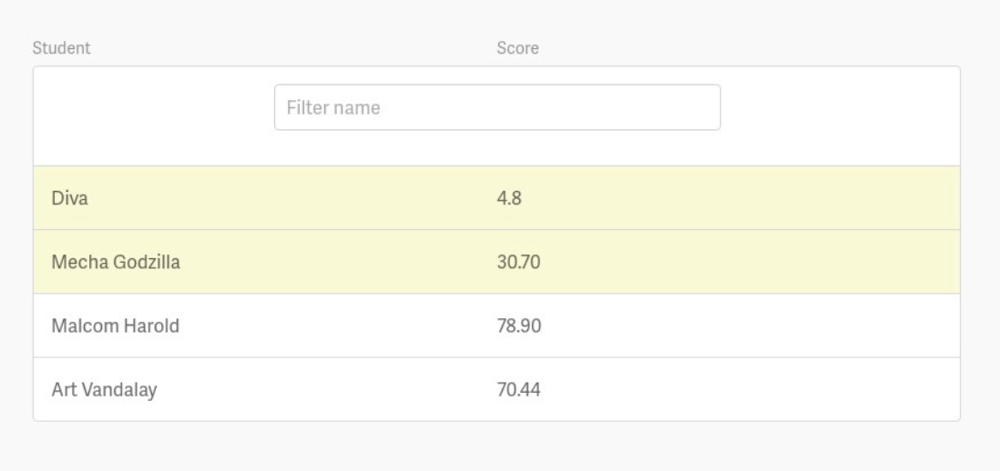

# Student Scores

> ~1 Hour

## The Task

Given a set of student records, represent them in a list UI. The list should have:

- Two columns. One column for student name, One column for score
- It should contain a header row with titles of both columns
- Any record with a score < 35 should be highlighted
- You won’t be critiqued on design
- Include a filter that allows sub-string matches on the combined student name. I.e., in the example below, entering Mecha would return one row.
- Clicking on the either title column should sort the records by that column in ascending order.
- Continuing to click on the same column alternates the sort order between ascending and descending order.

Reminder: You are free to use access the internet to help solve the problem, i.e., Google, stackoverflow, MDN.

### Example



## Rules & Persmissions

- It’s ok to google
- Your solution doesn’t need to support all browsers, just tell us what browser it
should support.
- It’s ok to use any js library or framework, E.g., jquery, react, backbone, etc. (or
none)
- It’s ok to use ES6
- It’s advised to use a css precompiler
- It’s ok to use any tools or development environment. E.g., codepen, sublime, VS
Code.
- Try not to use a css framework like Bootstrap. We would like to see how you to
create your own styling.
- It’s not ok to use a premade list component.

## The Data

The data is in the following publicly accessible json file:

[https://pearson-bronte-interview.s3.ap-southeast-2.amazonaws.com/students.json](
https://pearson-bronte-interview.s3.ap-southeast-2.amazonaws.com/students.json)

It contains 1000 records in the format of:

```
id: integer 
firstName: string 
lastName: string 
lessonScore: 0.0 < number < 100.0
```

Example:

```json
[{"id":1,"firstName":"Walter","lastName":"Grant","lessonScore":27.0}, {"id":2,"firstName":"Debra","lastName":"Stewart","lessonScore":71.48},...
```
